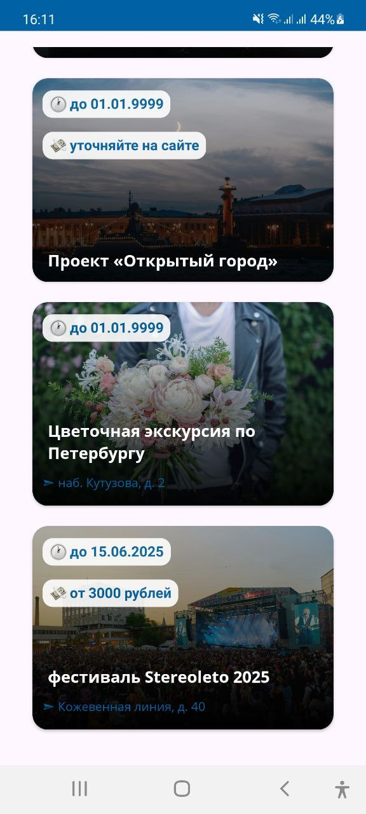
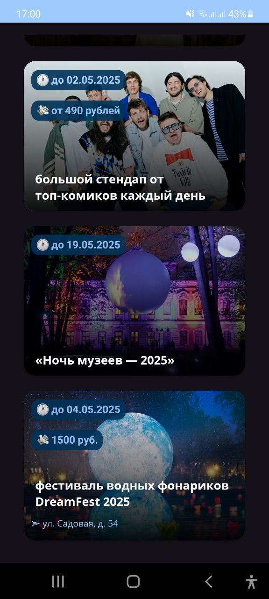

# EVENT POSTER
📅 EventPoster — это Android-приложение, которое позволяет пользователям просматривать предстоящие мероприятия в Москве.
Оно создано как **pet-проект** для практики Android-разработки, архитектуры, работы с API и UI-дизайна.

*Cобытия и достопримечательности взяты с API сайта [KudaGo](https://kudago.com)*

## 📸 Скриншоты

| Светлая тема | Теманая тема |
|---------------|--------------------------|
|  |  |

## 🛠️ Стек технологий

- **Язык:** Kotlin  
- **UI:**
  - XML + CustomView
  - RecyclerView + DiffUtill
- **Сетевой слой:** Retrofit + kotlinx-serialization
- **Асинхронность:** Coroutines + Flow  

## 📁 Структура проекта

```
├── spectacle/                    # Модель события или достопримечательности
├── ui/                           # Custom View
├── adapters/                     # RecyclerView и DiffCallback
├── ktx/                          # View Model и хендлер ошибок
├── webApi/                       # Сетевые компоненты
├── use_cases/                    # Domain слой приложения
├── ChoiceScreenState             # Возможные состояния экрана
├── MainActivity             
```

## 🚀 Установка
1. Клонируй репозиторий:
```bash
 git clone https://github.com/YusayuSharingan/EventPoster.git
```
2. Открой в Android Studio
3. Собери и запусти на эмуляторе или устройстве

## 📌 Планы на будущее
- Добавить тесты и логирование
- Добавить раширенное описание каждого события внутри фрагмента
- Добавить возможность сохранять понравившиеся события и делиться ими с другими пользователями (будут использованы Room или Shared Preferences)
